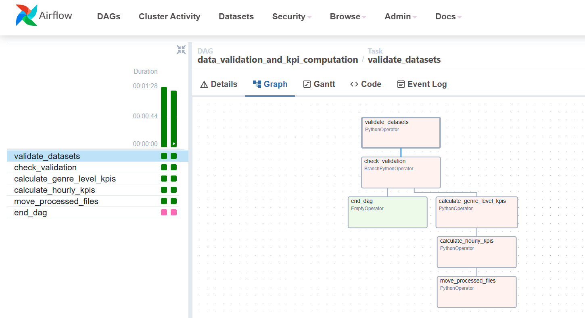

# 🎧 Spotify Streaming Data ETL Pipeline

This project implements a data pipeline to process Spotify-like streaming data using **Apache Airflow**, **Amazon S3**, and **Amazon Redshift**, producing clean analytical KPIs at the genre and hourly level.

---

## 🖼️ Visuals

```markdown


```

---

## ✅ Tools Used

- Apache Airflow
- Amazon S3
- Amazon Redshift
- Python (Pandas)
- Jupyter Notebooks

---

## ⚙️ Workflow Overview

1. Upload CSVs to S3 (users, songs, streams)
2. Create Redshift tables from `redshift-tables.sql`
3. Deploy DAG to Airflow
4. Configure S3 and Redshift connections in Airflow
5. Run DAG to transform and load data


---

## 📁 Folder Structure

```
.
├── airflow-dag/                  # Airflow DAG definition
│   └── dag-song-kpi-calculations.py
├── data/                         # Input data files
│   ├── songs.csv
│   ├── users.csv
│   └── streams1.csv, streams2.csv, streams3.csv
├── local-development/           # Jupyter notebooks for dev/testing
│   ├── genre-level-kpis.ipynb
│   └── hourly-kpis.ipynb
├── redshift/
│   └── redshift-tables.sql       # Table schema for Redshift
├── images/                      # Architecture & DAG visuals
└── README.md
```

---


## 🧾 KPI Outputs

### 🎵 Genre-Level KPIs
| Column                 | Description                          |
|------------------------|--------------------------------------|
| `listen_date`          | Date of listening                    |
| `track_genre`          | Genre of track                       |
| `listen_count`         | Total number of listens              |
| `popularity_index`     | Weighted popularity score            |
| `average_duration`     | Average duration per genre           |
| `most_popular_track_id`| Most streamed track in genre         |

### ⏱ Hourly KPIs
| Column                   | Description                            |
|--------------------------|----------------------------------------|
| `listen_date`            | Date                                   |
| `listen_hour`            | Hour of listening                      |
| `unique_listeners`       | Count of distinct users                |
| `top_artist`             | Most streamed artist                   |
| `listen_counts`          | Number of total streams                |
| `avg_sessions_per_user`  | Sessions per user (avg)                |
| `diversity_index`        | Genre/artist variety metric            |
| `most_engaged_age_group` | Age group with highest interaction     |

---

